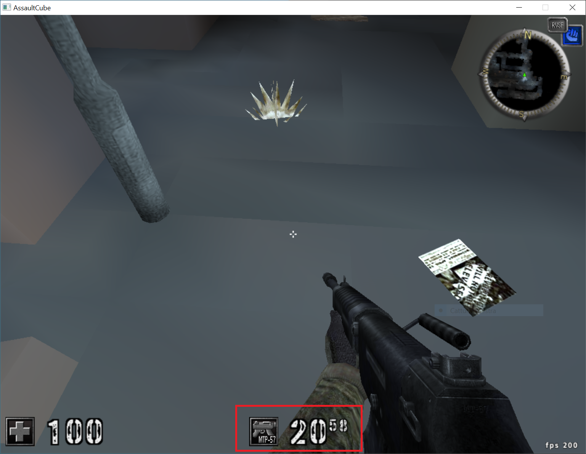
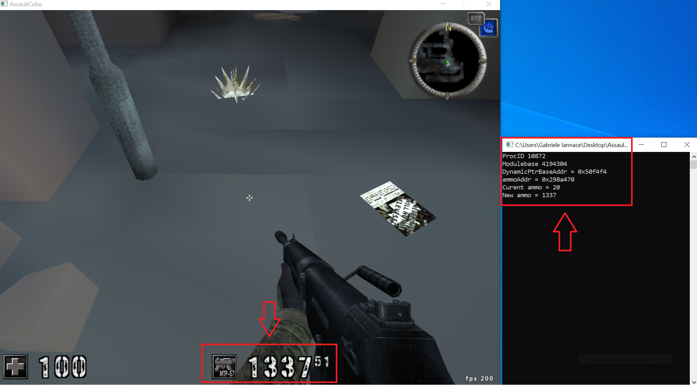

# AssaultCubeHack
Read/write memory experiment based on multi-level pointer and getting Process-ID using windows name. (Windows API)

# Screenshot

- Normal game ammo.

- Hacked game ammo reading and writing in memory

